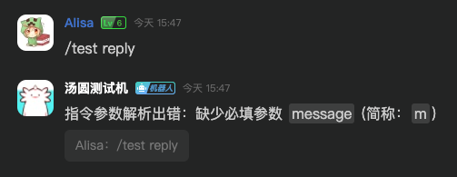

# 指令系统

指令是 BOT 最常用到的功能，因此 DodoHosted 在频道文字消息的基础上，制作了指令系统。

指令系统主要由指令执行器和权限管理器组成。

## 指令

一条指令的样式如下：

``` txt
{{PREFIX}}island send text -c #文字频道 -m "你好\n \"世界\"" -b -a 123
```

其中，`{{PREFIX}}` 是单个字符，可以自定义配置，默认值为 `!`。

前缀后的第一个空格分隔指令的名称和指令路径及参数表。

如果有参数中需要包含空格，或者转义字符，可以使用双引号包裹参数。

在指令系统匹配到前缀后，将会对指令进行拆分和分析，然后匹配指令执行器，去执行指令。

例如，上面的指令将会被拆分为：

- 指令名称：`island`
- 指令路径：`send text`
- 参数 1：`c` (字符串) -> `#文字频道`
- 参数 2：`m` (字符串) -> `你好\n "世界"`
- 参数 3：`b` (布尔值) -> `true`
- 参数 4：`a` (整数) -> `123`

## 指令执行器

`ICommandExecutor` 接口定义了指令执行器的接口，创建一个标记为 `sealed` 的类，继承该接口。

> 给实现类添加 `AdminIslandOnly` Attribute 可以限定该指令只能在管理群组使用

该接口包含一个需要实现的方法，该方法用于构建指令树：

```csharp
CommandTreeBuilder GetBuilder();
```

先不管这个方法的如何实现，首先实现指令的执行器。

### 执行方法

指令执行方法需要满足以下条件：

- 方法必须是 `public` 的
- 方法必须返回 `Task<bool>`
- 方法参数除了 `CommandContext` 之外，必须有 `[CmdOption]` 或 `[Inject]` 标签

> `InjectAttribute` 的命名空间为 `DodoHosted.Base.App.Attributes`

例如，一个简单的用于回复用户发送的消息的指令执行器：

```csharp
public async Task<bool> ReplyUser(
    CommandContext context,
    [CmdOption("message", "m", "消息")] string message)
{
    await context.Reply.Invoke(message);
    return true;
}
```

假设该指令的路径为 `/test reply`，则可以通过 `/test reply -m 我的消息` 或 `/test reply --message 我的消息` 来触发。其中，此处 CmdOption 标定的参数为必须参数，因此指令中必须有 `-m` 存在，否则将会抛出异常。




CmdOption 可以是可选的，对于可选参数，类型必须为可空类型，即 `string?` 或 `int?` 等。

```csharp
public async Task<bool> ReplyUser(
    CommandContext context,
    [CmdOption("message", "m", "消息", false)] string? message)
{
    await context.Reply.Invoke(message ?? "消息为空");
    return true;
}
```


CmdOption 构造函数如下，可以设置参数的简写，说明，是否必须。

需要注意的是，全称 `help` 与 简称 `?` 为保留值，参数的 name 不可为 `help`，简称不可为 `?`。

```csharp
/// <summary>
/// 指令参数 Attribute
/// </summary>
/// <param name="name">参数名称</param>
/// <param name="abbr">参数简写</param>
/// <param name="description">简介，默认为空</param>
/// <param name="required">是否为必须，默认为 true</param>
public CmdOptionAttribute(string name, string? abbr = null, string description = "", bool required = true)
{
    Name = name;
    Abbr = abbr;
    Required = required;
    Description = description;
}
```

CmdOption 引入的参数类型可以为以下类型：

- `string` 字符串
- `int` 整数
- `long` 长整数
- `double` 浮点数
- `bool` 布尔值，在指令中使用时，假设简称为 `f`，则有 `-f` 即为 `true`，否则为 `false`，不需要在名称后加上值
- `DodoChannelId` Dodo 频道 ID，在传入时，可以是频道的数字 ID，也可以使用 `#` 进行频道引用
- `DodoChannelIdWithWildcard` Dodo 频道 ID，与 `DodoChannelId` 相比，允许 `*` 通配符
- `DodoMemberId` Dodo 用户 ID，在传入时，可以是用户的数字 ID，也可以使用 `@` 进行用户的引用
- `DodoEmoji` Emoji 表情，仅限单个表情

```csharp
public async Task<bool> CustomTypes(
    CommandContext context,
    [CmdOption("channel", "c", "频道")] DodoChannelId channel,
    [CmdOption("channel-wc", "w", "通配频道")] DodoChannelIdWithWildcard channelWithWildcard,
    [CmdOption("user", "u", "用户")] DodoMemberId user,
    [CmdOption("emoji", "e", "Emoji 表情")] DodoEmoji emoji)
{
    var msg = new StringBuilder();
        
    msg.AppendLine("Channel Ref: " + channel.Ref);
    msg.AppendLine("Channel ID: " + channel.Value);
    msg.AppendLine("ChannelWithWildcard Ref: " + channelWithWildcard.Ref);
    msg.AppendLine("ChannelWithWildcard Is wildcard: " + channelWithWildcard.IsWildcard);
    msg.AppendLine("User Ref: " + user.Ref);
    msg.AppendLine("User ID: " + user.Value);
    msg.AppendLine("Emoji: " + emoji.Emoji);
    msg.AppendLine("Emoji ID: " + emoji.EmojiId);

    await context.Reply.Invoke(msg.ToString());
    return true;
}
```


 
### 指令树构建器

请参考内置的 `pm` 指令的示例：

```csharp
public CommandTreeBuilder GetBuilder()
{
    return new CommandTreeBuilder("pm", "权限管理器", "system.permission")
        .Then("add", "添加权限节点", "modify", AddPermission)
        .Then("set", "修改权限节点", "modify", SetPermission)
        .Then("remove", "移除权限节点", "modify", builder: x => x
            .Then("single", "根据 ID 移除单个权限节点", string.Empty, RemovePermissionById)
            .Then("nodes", "根据节点匹配移除多个权限节点", string.Empty, RemovePermissionByNode)
            .Then("search", "根据频道与身份组检索进行移除", string.Empty, RemovePermissionBySearch))
        .Then("list", "列出权限节点", "list", ListPermissions)
        .Then("check", "测试用户权限检查", "check", CheckPermission);
}
```

- 在运行 `pm add` 指令时，会执行 `AddPermission` 方法，该指令的权限为 `system.permission.modify`
- 在运行 `pm remove single` 指令时，会执行 `RemovePermissionById` 方法，该指令的权限为 `system.permission.modify`
- 在运行 `pm remove` 指令时，由于该指令没有对应的 Method，因此将不会被执行，并返回 `指令路径不存在` 的错误

## 权限管理器

DodoHosted 实现了一套类似于 Minecraft Bukkit 的权限系统，可以使用 `IPermissionManager` 进行权限的管理。

权限由权限节点、作用域、以及值组成，权限节点格式类似于：

``` txt
system.command.*
system.command.help
system.command.pm.add
your.own.permission.node
```

其中，`system.command.*` 将能够同时匹配 `system.command.help` 与 `system.command.pm.add`。

在插件中定义权限节点时，不可以使用通配符，通配符仅是用于设置用户权限使用的。其次，请勿使用以 `system` 开头的权限节点，这些权限节点是系统保留的。

作用域由频道和身份组共同定义，值可以是 `allow` 或者 `deny`。

假设某条指令需要 `my.command.hello` 权限，则在检查权限时，将会依次按照顺序寻找：

``` txt
my.command.hello
my.command.*
my.*
*
```

在找到有某个定义后，则会按照顺序匹配作用域：

``` txt
1. 频道 与 身份组 均匹配
2. 频道 匹配，身份组为通配符
3. 频道 为通配符，身份组 匹配
4. 频道 为通配符，身份组 为通配符
```

找到的第一个匹配项目就将会返回。

例如，有如下权限定义：

| Node             | Channel | Role | Value |
|------------------|---------|------|-------|
| my.command.hello | *       | A    | allow |
| my.command.hello | CB      | A    | deny  |
| my.command.*     | CA      | *    | allow |

1. 在频道 CA 中，身份组为 A 的用户使用指令

    匹配 `my.command.hello`，找到了两个节点定义，按照顺序，匹配到频道为 `*`，身份组为 `A` 的定义，因此结果为 `allow`

2. 在频道 CB 中，身份组为 A 的用户使用指令

    匹配 `my.command.hello`，找到了两个节点定义，按照顺序，匹配到频道为 `CB`，身份组为 `A` 的定义，因此结果为 `deny`

3. 在频道 CA 中，身份组为 B 的用户使用指令

    匹配 `my.command.hello`，找到了两个节点定义，但是这两个节点均不匹配，因此再去寻找 `my.command.*` 的节点定义，共有一个，匹配到频道为 `CA`，身份组为 `*` 的定义，因此结果为 `allow`

4. 在频道 CB 中，身份组为 B 的用户使用指令

    匹配 `my.command.hello`，找到了两个节点定义，但是这两个节点均不匹配，因此再去寻找 `my.command.*` 的节点定义，共有一个，但是该节点也不匹配，再去寻找 `my.*` 与 `*` 节点，均不存在，因此返回默认值 `deny`。

## 内置指令

DodoHosted 内置了 4 个指令：

- `help` 查看帮助信息
- `pm` 权限管理
- `island` 群组管理
- `system` 系统管理（仅限管理群组）

### 帮助指令

`help` 帮助指令为一个内置指令，在编写插件指令时，可以使用该指令查看编写的指令生成的帮助信息。

运行 `help` 将列出所有执行者有权限执行的根指令。


`help` 指令接受两个可选参数，分别为 `name (简称: n)` 和 `path (简称: p)`，分别用于查看对应指令的帮助，以及对应指令和对应路径的帮助。

例如，执行 `help -n pm` 用于查看权限管理指令的帮助，执行 `help -n pm -p remove,single` 查看 `pm remove single` 指令的帮助。


对于帮助指令，存在一种简写，在任意指令，任意路径后，加上 `--help` 或 `-?` 即可查看当前指令，当前路径的帮助信息。例如 `help -n pm -p remove,single` 可以为 `pm remove single -?` 或 `pm remove single --help`。


