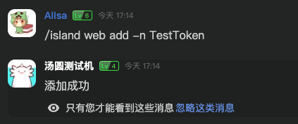
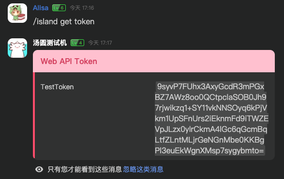

# Web 事件

DodoHosted 使用 ASP.NET Core 作为 Web 服务器，目前有一个 POST 终结点 `plugin/{pluginIdentifier}/{webHandlerName}` 使得插件可以处理来自 Web 的请求。

## IPluginWebHandler 接口

插件可以实现 IPluginWebHandler 接口来处理 Web 请求。

例如：

```csharp
[Name("test")]
public sealed class TestWebHandler : IPluginWebHandler
{
    public async Task<OkObjectResult> Handle(HttpRequest request)
    {
        var str = await request.ReadBodyAsStringAsync();
        return new OkObjectResult(str);
    }
}
```

实现类需要有 `NameAttribute` 用于标定该 Handler 的名称，此名称在同一个插件中不能重复，将会用于 Web API 的路径，因此应当尽可能避免在 URL 中需要转义的特殊字符。

假设插件标识符为 `test-plugin`，Web API Host 为 `http://localhost:5000`，则上述代码将会处理 `http://localhost:5000/plugin/test-plugin/test` 的请求。

## Web 请求鉴权

Web 请求需要在 Header 附加两个值

- `dodo-hosted-api-token` API Token
- `dodo-hosted-island` API Token 所属的群组

API Token 可以在群组内通过指令生成，管理群组中，可以使用 `system` 指令管理其他群组是否可以使用 Web API，以及 API Token 的最大数量。

例如，运行 `island web add -n TestToken` 添加一个名为 `TestToken` 的 API Token:



然后使用 `island get token` 指令查看所有 API Token，或者使用 `island get token -n <Token 名称>` 查看某个 Token 的值：



接着，在 Web 请求中可以使用这两个 Token：

> 在示例中，Web Handler 是通过 Native 方式载入的，因此其标识符为 `native-<程序集名称>`，此处示例为 `native-DodoHosted.Lib.Plugin`

请求：

```http request
POST http://localhost:6375/plugin/native-DodoHosted.Lib.Plugin/test
dodo-hosted-api-token: <生成的 Token>
dodo-hosted-island: <Token 所属的群组 ID>
Content-Type: text/plain

测试 Body 字符串
```

返回：

```text
HTTP/1.1 200 OK
Content-Type: text/plain; charset=utf-8
Date: Sat, 24 Sep 2022 09:26:09 GMT
Server: Kestrel
Transfer-Encoding: chunked

测试 Body 字符串

Response code: 200 (OK); Time: 237ms (237 ms); Content length: 11 bytes (11 B)
```

## Master Token

在运行 DodoHosted 时，可以设置 `DODO_HOSTED_WEB_MASTER_TOKEN` 环境变量，此 Token 为 Master Token，使用此 Token 时，不需要 `dodo-hosted-island` 头。
